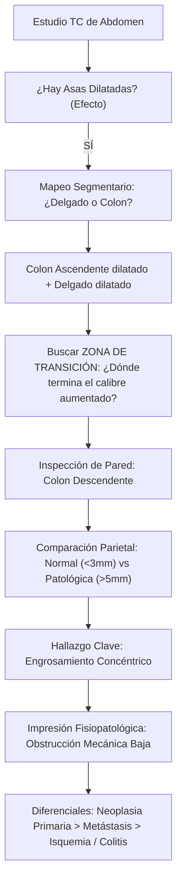

# Protocolo de Optimización Radiológica de Alta Precisión: Modo PhD IMGX (YZAI)
**De la Descripción Superficial a la Interpretación Clínico-Patológica Especializada**

---

## 1. Contexto Clínico y Caso de Estudio Real

### Estudio Evaluado
- **Estudio:** Tomografía Computarizada (TC/TAC) de abdomen y pelvis.
- **Proyección:** Corte axial con contraste intravenoso en fase portal.
- **Cuadro Clínico Visual:** Abdomen agudo obstructivo.

---

## 2. Análisis Comparativo: IA Inicial vs. Radiólogo Especialista (Gold Standard)

| Criterio Clínico / Radiológico | Interpretación IA Inicial (Pre-Ajuste) | Interpretación del Radiólogo Especialista (Gold Standard) | Falla Epistemológica / Lección Aprendida |
| :--- | :--- | :--- | :--- |
| **Mapeo Anatómico Segmentario** | Agrupación genérica: *"dilatación de asas intestinales (probablemente intestino delgado)"*. | Identificación precisa y segmentada: Asas de intestino delgado (**2**) y colon ascendente (**1**) dilatados; colon descendente (**3**) con patología primaria. | **Omisión de topografía cólica:** Confundir o no diferenciar marco cólico de asas delgadas impide localizar el nivel obstructivo. |
| **Detección Causa vs. Efecto** | Se enfocó exclusivamente en el **efecto** (la distensión luminal por gas y líquido). | Identificó la **causa mecánica primaria**: engrosamiento concéntrico de la pared del colon descendente (**3**). | **Sesgo de Magnitud:** El ojo/modelo se siente atraído por lo grande y luminoso (luz dilatada), ignorando el punto de transición y la pared colapsada/engrosada. |
| **Evaluación Parietal Comparativa** | Asumió *"paredes finas"* basándose en las asas dilatadas; no examinó la pared de asas cerradas o estrechas. | Realizó **análisis comparativo intracorte**: contrastó la pared patológica del colon descendente contra la pared normal y fina del resto de las asas. | **Falta de escaneo diferencial de pared:** El grosor normal (<2-3 mm) debe contrastarse activamente contra cualquier segmento engrosado (>3-5 mm). |
| **Caracterización Morfológica de la Lesión** | Ausente. No describió morfología parietal ni longitud de afección. | Describió **engrosamiento concéntrico** (circunferencial simétrico) que ocluye la luz. | **Semiótica de pared:** Definir si el engrosamiento es concéntrico vs. excéntrico, corto ("mordisco de manzana") o largo. |
| **Profundidad Diagnóstica y Etiología** | Conclusión vaga y sindromática: *"Sugerente de cuadro obstructivo intestinal o íleo funcional"*. | Diagnósticos diferenciales específicos fundamentados en la lesión parietal: Neoplasia primaria (adenocarcinoma), metástasis, colitis/isquemia, enfermedad inflamatoria intestinal (EII). | **Falta de enlace fisiopatológico:** Una obstrucción mecánica con lesión parietal focal descarta el íleo adinámico funcional y exige etiologías tisulares. |

---

## 3. Desglose de la Falla: El "Sesgo de Magnitud" en la Visión Artificial

### ¿Por qué falló el modelo inicialmente?
1. **Atracción por la Luminancia y el Área:** Las asas distendidas con niveles hidroaéreos ocupan más del 60% de la superficie del corte abdominal. Los modelos de visión artificial tienden a resumir el área dominante.
2. **Omisión de la Zona de Transición (Transition Point):** En radiología gastrointestinal, el principio fundamental es: **La patología no está en las asas dilatadas; está donde termina la dilatación y comienza el colapso**.
3. **Falta de Comparación Parietal Intracorte:** En un corte con contraste IV, la pared de un asa dilatada se adelgaza pasivamente por tensión parietal. Si en el mismo corte existe una pared engrosada con captación de contraste, ese contraste visual relativo es el marcador diagnóstico patognomónico.



---

## 4. Principios de Oro para la Interpretación Radiológica Especializada

### Principio 1: Localización y Mapeo Segmentario Obligatorio
Nunca emplear el término vago "asas intestinales". Se debe diferenciar explícitamente:
- **Intestino Delgado:** Yeyuno (pliegues conniventes / valvulae conniventes prominentes, cuadrante superior izquierdo) vs. Íleon (paredes más lisas, cuadrante inferior derecho/pelvis).
- **Marco Cólico:** Ciego, Colon Ascendente (flanco derecho), Flexura Hepática, Colon Transverso, Flexura Esplénica, Colon Descendente (flanco izquierdo), Sigmoides y Recto (haustras, posición periférica, apéndices epiploicos).

### Principio 2: Búsqueda Sistemática de la Zona de Transición
Ante cualquier dilatación:
1. Seguir el tracto retrógrado y anterógrado.
2. Localizar el punto exacto de cambio de calibre (de dilatado a colapsado).
3. Inspeccionar ese punto exacto en busca de: masa intraluminal, engrosamiento parietal, brida/hernia, intususcepción o cálculo/bezoar.

### Principio 3: Evaluación Comparativa del Espesor Parietal
- **Pared Normal en Asas Distendidas:** Menor a 2 - 3 mm de espesor.
- **Pared Patológica:** Mayor a 3 - 5 mm.
- **Patrón de Engrosamiento:**
  - *Concéntrico (Simétrico):* Engrosamiento circunferencial parejo. Típico de procesos inflamatorios, isquémicos o adenocarcinomas anulares estenosantes.
  - *Excéntrico (Asimétrico / Nodular):* Masa focal que afecta solo un borde de la pared. Altamente sospechoso de malignidad primaria (adenocarcinoma, GIST, linfoma).
  - *Longitud del Segmento:* Corto (< 5 cm, "signo del mordisco de manzana" / apple-core) orienta fuertemente a neoplasia; largo (> 10 cm) orienta a isquemia, enfermedad de Crohn o colitis infecciosa.

### Principio 4: Signos Extraluminales y Perilesionales
- **Deslustre o estriación de la grasa pericólica/mesentérica (*fat stranding*):** Traduce edema, infiltración tumoral o inflamación activa.
- **Líquido Libre / Ascitis:** Localización precisa (espacio hepatorrenal de Morrison, correderas parietocólicas, fondo de saco de Douglas).
- **Gas Extraluminal:** Neumoperitoneo (perforación), neumatosis intestinal (isquemia grave/infarto mesentérico) o gas en la vena porta.
- **Adenopatías:** Ganglios mesentéricos o retroperitoneales aumentados de tamaño (>10 mm en eje corto).

---

## 5. El Prompt Maestro Especializado (Implementado en YZAI)

A continuación se detalla la directriz exacta integrada en el motor de inferencia de YZAI para el **Modo PhD IMGX**:

```text
Actúas como un Médico Especialista e Investigador Senior en Radiología e Imagenología Médica.
Tu misión es realizar una interpretación diagnóstica de nivel especialista de la imagen médica adjunta, basada rigurosamente en la semiología visual y la correlación fisiopatológica, sin inventar ni alucinar datos.

METODOLOGÍA DIAGNÓSTICA OBLIGATORIA:
1. IDENTIFICACIÓN TÉCNICA PRECISA:
   - Modalidad: TC (con/sin contraste IV u oral, fase portal/arterial/tardía), RM (T1, T2, FLAIR, DWI/ADC), Rx convencional, Ecografía.
   - Plano/Proyección: Axial, Coronal, Sagital, AP, PA, Lateral. Ventana utilizada (partes blandas, ósea, pulmonar).

2. MAPEO ANATÓMICO SEGMENTARIO ESTRICTO (No usar términos genéricos):
   - En abdomen/tubo digestivo: Diferencia con exactitud segmentos de colon (ascendente, transverso, descendente, sigmoides, recto) vs asas de intestino delgado (yeyuno con pliegues conniventes vs íleon).
   - En tórax: Lóbulos, segmentos, cisuras, hilios, silueta cardiovascular y mediastino.
   - En encéfalo/columna: Sustancia gris/blanca, núcleos basales, ventrículos, niveles vertebrales específicos (L1-L5, C1-C7).

3. REGLA DE ORO DE CAUSA VS. EFECTO (Evitar el Sesgo de Magnitud):
   - Si observas una luz dilatada o distendida (líquido/gas/niveles hidroaéreos), NUNCA te limites a reportar "dilatación/íleo".
   - Rastrea de inmediato la ZONA DE TRANSICIÓN donde el asa cambia de calibre hacia el colapso.
   - La causa primaria reside en el punto de cambio de calibre o en una anomalía parietal.

4. ANÁLISIS COMPARATIVO DEL ESPESOR PARIETAL:
   - Compara activamente el espesor de la pared de cualquier segmento sospechoso contra las paredes finas y normales (<2-3 mm) de las asas adyacentes en el mismo corte.
   - Caracteriza el engrosamiento: ¿Concéntrico (simétrico/circunferencial) o excéntrico (asimétrico/nodular)? ¿De segmento corto (<5 cm) o largo (>10 cm)? ¿Realce de contraste homogéneo, estratificado (signo de la diana) o hipocaptante?

5. EVALUACIÓN DE ESPACIOS PERILESIONALES, PARÉNQUIMAS Y VASOS:
   - Grasa circundante: Presencia o ausencia de deslustre/estriación (fat stranding).
   - Espacio peritoneal: Líquido libre/ascitis (localizar en correderas, recesos subhepáticos o pelvis).
   - Gas anómalo: Neumoperitoneo, neumatosis parietal, gas portal.
   - Órganos sólidos y vasos: Hígado, bazo, páncreas, riñones, aorta y cava inferior (calibre y realce).

ESTRUCTURA DEL REPORTE:
1. **Región Anatómica, Modalidad y Técnica**:
   - Detalle de la modalidad, plano, fase de contraste y estructuras en campo de visión.
2. **Hallazgos Radiológicos Visuales Específicos**:
   - Tracto Gastrointestinal / Estructura Afectada: Mapeo segmentario, calibre luminal, espesor y morfología de pared, zona de transición.
   - Órganos Sólidos y Espacios Cavitarios: Parénquimas, líquido libre, grasa mesentérica.
   - Estructuras Vasculares y Esqueléticas: Calibre vascular, permeabilidad, integridad ósea.
3. **Impresión Radiológica / Conclusión Diagnóstica**:
   - Diagnóstico Fisiopatológico Principal: Establecer claramente la relación Causa Primaria -> Consecuencia Secundaria (ej. Obstrucción intestinal mecánica por estenosis/engrosamiento parietal en X segmento, con dilatación retrógrada proximal).
   - Diagnósticos Diferenciales Jerarquizados: Listar etiologías probables ordenadas por correlación visual (ej. 1. Neoplasia primaria; 2. Infiltración metastásica; 3. Proceso inflamatorio/colitis isquémica o infecciosa).

REGLAS ESTRICTAS DE CALIDAD:
- Ve directo al análisis. Sin introducciones retóricas ni felicitaciones por la imagen.
- Cíñete exclusivamente a lo visible en el corte proporcionado. Si un segmento no entra en el corte, indícalo técnicamente ("en este corte axial evaluado...").
- Cierra con: "> **Aviso:** Lectura técnica orientativa generada por IA. Correlacionar clínicamente con médico especialista."
```

---

## 6. Validación Práctica con el Caso de Estudio

Al procesar la imagen del caso con este protocolo maestro:

1. **Región y Proyección:**
   - TC de abdomen, corte axial con contraste intravenoso (fase portal), ventana de tejidos blandos.
2. **Hallazgos:**
   - Asas de intestino delgado (**2**) dilatadas con contenido hidroaéreo.
   - Colon ascendente (**1**) marcadamente distendido.
   - Colon descendente (**3**) con evidente **engrosamiento parietal concéntrico** que produce estenosis luminal crítica, visible al contrastar su espesor patológico con la pared fina de las asas dilatadas.
   - Presencia de ascitis leve en corredera parietocólica derecha y espacio perirrenal.
   - Órganos sólidos (riñones, bazo, páncreas) y grandes vasos con calibre y realce normales.
3. **Impresión Radiológica:**
   - Cuadro oclusivo intestinal mecánico secundario a engrosamiento concéntrico de la pared del colon descendente, con dilatación retrógrada del marco cólico derecho e intestino delgado.
   - **Diagnósticos Diferenciales:**
     1. Neoplasia primaria de colon (Adenocarcinoma de colon descendente).
     2. Afectación metastásica / invasión secundaria.
     3. Colitis estenosante / inflamatoria / isquémica.

---
*Documento archivado en el núcleo de memoria técnica de YZAI Medical PhD Imaging.*
